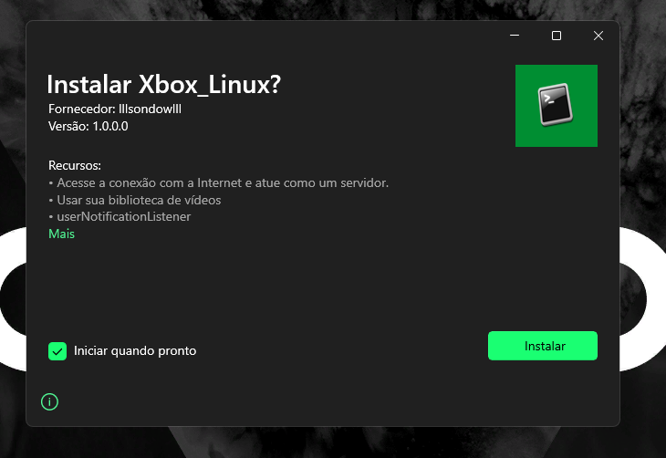
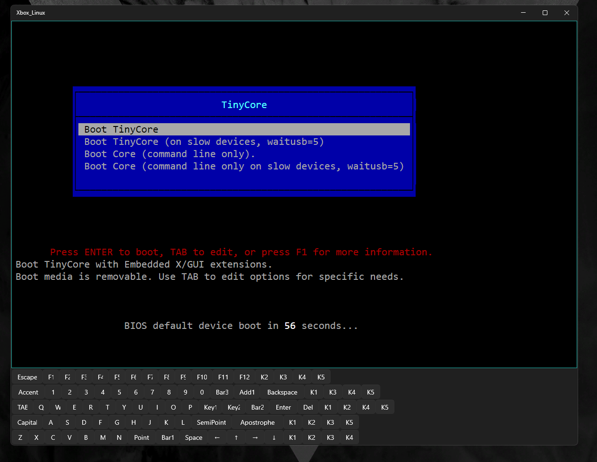

This Repository contains custom deployment implimentations and modified methods to deploy Linux to Xbox X64 platforms from Xbox One through current (Series S/X).

[Shell]

v86

[UWP]

Xbox-Linux
Uses the v86 emulator as a base to run operating systems

The K1, K2, K3, K4 and K5 buttons only change the visibility of parts of the virtual keyboard.

Builds: https://drive.google.com/drive/folders/1n9jw151wiW8l8GhVlZkrxvNmP2NsF8KU?usp=sharing

