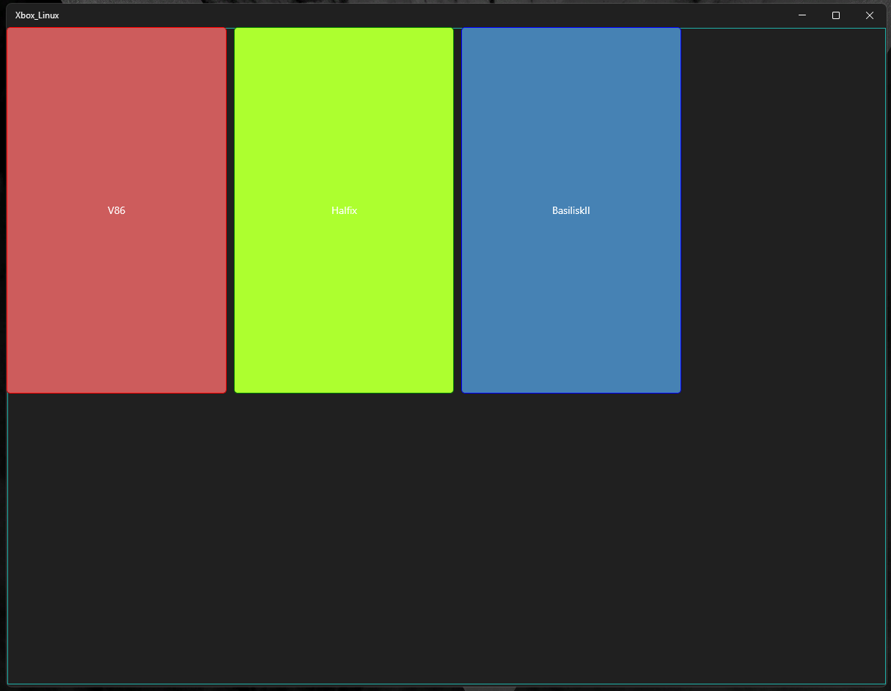
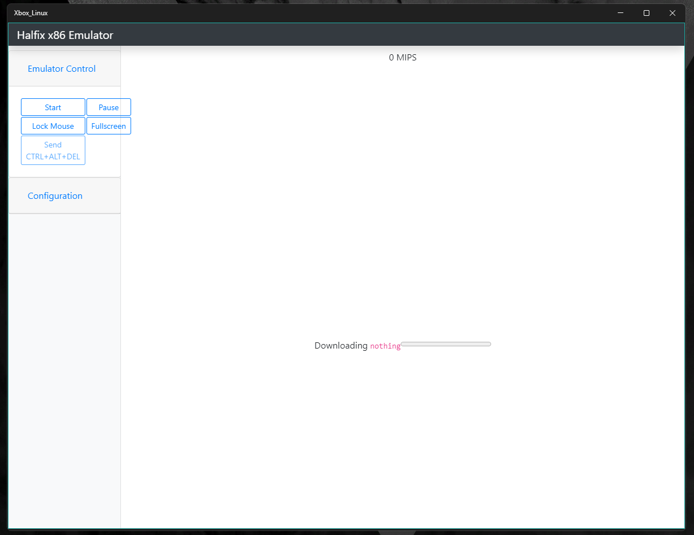
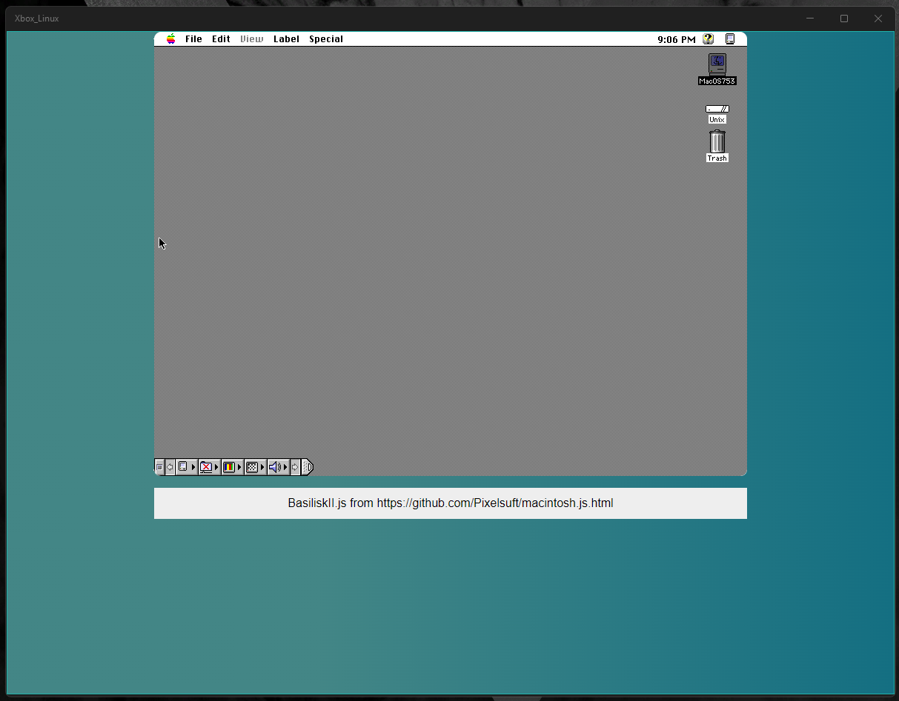

This Repository contains custom deployment implimentations and modified methods to deploy Linux to Xbox X64 platforms from Xbox One through current (Series S/X).

[Shell]

v86

[UWP]

Xbox-Linux
Emulators:

- V86
- Halfix
- BasiliskII

The K1, K2, K3, K4 and K5 buttons only change the visibility of parts of the virtual keyboard and it only works on v86.

Builds: https://drive.google.com/drive/folders/1n9jw151wiW8l8GhVlZkrxvNmP2NsF8KU?usp=sharing

## old build with only v86

